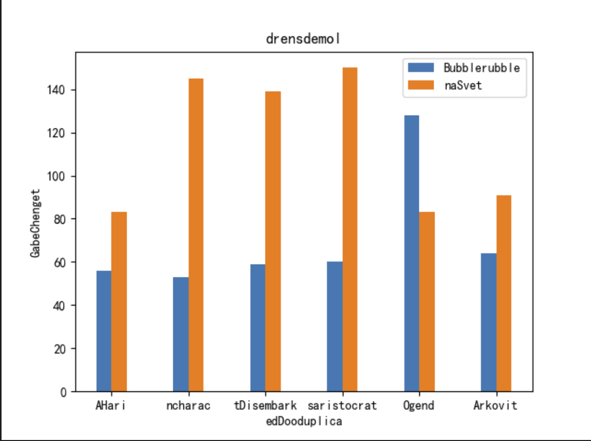
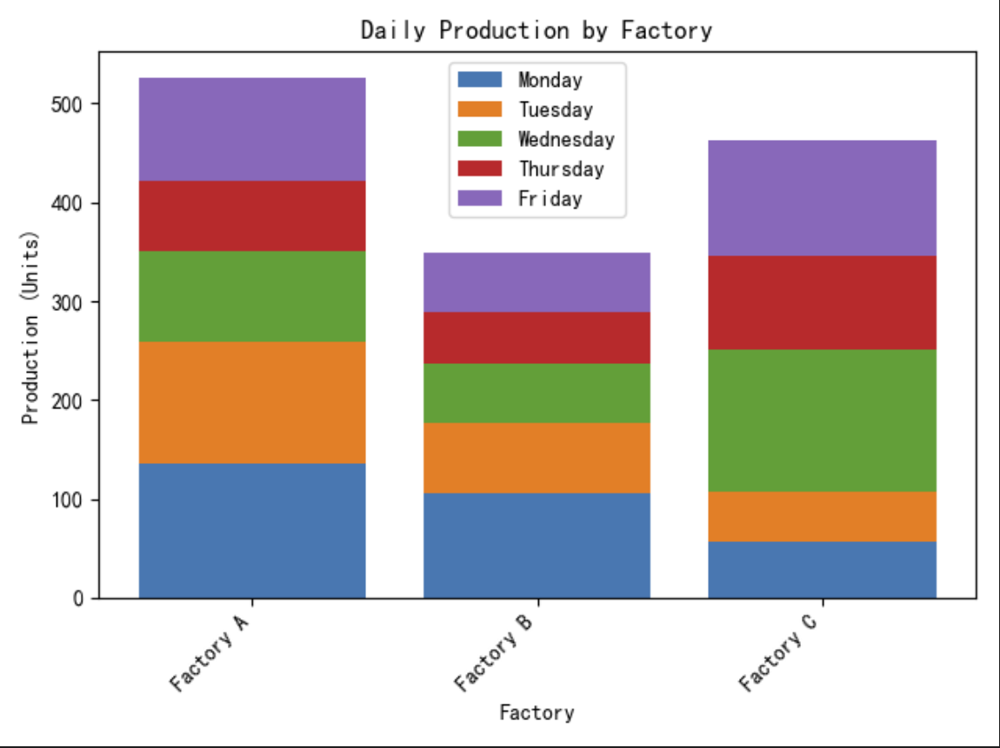

# ChartGeneration

Generation of Chart(pie/bar/line) image and corresponding information(int json) for (Chart QA) specific LMM training datasets using matplotlib

Allows for two different type of generation:
1. chart with random(no-meaning) words
2. chart with meaningful words

|Type|Example|
|---|---|
|Meaningless Words||
|Meaningful Words||

This is an example json of the information of the image
```json
{
    "image": "output/bar/bar_0_XI7XRJY2J3TAFKNP846V0.png", 
    "json": {
        "title": "Daily Production by Factory", 
        "x_title": "Factory", 
        "y_title": "Production (Units)", 
        "values": {
            "Monday": {"Factory A": 135, "Factory B": 105, "Factory C": 56}, 
            "Tuesday": {"Factory A": 124, "Factory B": 72, "Factory C": 51}, 
            "Wednesday": {"Factory A": 91, "Factory B": 60, "Factory C": 144}, 
            "Thursday": {"Factory A": 72, "Factory B": 52, "Factory C": 94}, 
            "Friday": {"Factory A": 104, "Factory B": 60, "Factory C": 118}}}, 
    "markdown": "### Daily Production by Factory\n\n\n# Monday\n| Factory | Production (Units) |\n| --- | --- |\n| Factory A | 135 |\n| Factory B | 105 |\n| Factory C | 56 |\n\n# Tuesday\n| Factory | Production (Units) |\n| --- | --- |\n| Factory A | 124 |\n| Factory B | 72 |\n| Factory C | 51 |\n\n# Wednesday\n| Factory | Production (Units) |\n| --- | --- |\n| Factory A | 91 |\n| Factory B | 60 |\n| Factory C | 144 |\n\n# Thursday\n| Factory | Production (Units) |\n| --- | --- |\n| Factory A | 72 |\n| Factory B | 52 |\n| Factory C | 94 |\n\n# Friday\n| Factory | Production (Units) |\n| --- | --- |\n| Factory A | 104 |\n| Factory B | 60 |\n| Factory C | 118 |\n", 
    "type": "bar"
}
```

## Generating Charts

### Charts with random texts
The texts are randomly generated from a dictionary. There are default dictionaries.

You will be able to replace the dictionary with your own dictionary by adding a dixtionary(.txt) to `ch_dict_path` or `en_dict_path`.
You can also indicate the language of the output image [chinese/english]
Both the image and the jsonl file will be stored in `output/chart/` by default

Example of generating 2 random bar chart at output/bar/
```bash
# generating 2 random bar chart
python generate_chart.py --chart_type='bar' --output_path='output/bar/' --img_count=2 --is_random
```

Random mode specific parameter settings:
```bash
--is_random    # random texts mode
--min_txt_len  # minimum length of the text
--max_txt_len  # maximum length of the text
```

General settings:
```bash
--output_path    # output file location
--ch_dict_path   # texts dictionary path (for generating random chinese texts)
--en_dict_path   # texts dictionary path (for generating random english texts)
--chart_type     # specifies the desired chart type
--img_count      # number of charts generated
--language       # specifies the language of the text

# pie chart specific
--max_slice      # maximum number of slices of pie chart
--min_slice      # minimum number of slices of pie chart

# bar/line specific
--min_subcate    # minimum number of sub-categories
--max_subcate    # maximum number of sub-categories
--min_categories # minimum number of categories
--max_categories # maximum number of categories
--val_range      # the range of values e.g. val_range=0.5, then the value will be within the range (50%, 150%)
--center_val     # the center value of the range
```